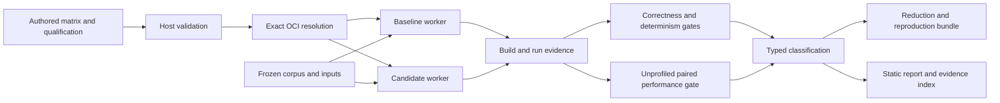

# Architecture

TensorRT UpgradeGuard separates an unprivileged host control plane from exact GPU worker containers.
This boundary keeps planning, validation, classification, and reporting independent of a host TensorRT installation.

## The challenge

A TensorRT result depends on more than one library version.
The driver, CUDA runtime, TensorRT build, compiler tools, plugins, model bytes, input bytes, builder settings, timing conditions, and GPU identity all contribute to the observation.

UpgradeGuard therefore qualifies complete locked stacks and never attributes a difference to TensorRT alone.

## Data flow

## Host control plane

The Python package owns strict contracts, OCI resolution, matrix locking, corpus materialization, command construction, evidence validation, statistical decisions, reduction, bundle verification, and static reporting.

Subprocess calls use argument arrays with no shell interpolation.
Writes use staging directories and atomic replacement for complete outputs.

## GPU worker plane

Each worker image derives from an exact base manifest and records that base digest in an OCI label.
The matrix lock records the final derived-worker manifest and configuration digests separately from the base identities.

Workers build engines, run correctness cases, and invoke `trtexec` inside a network-disabled container.
The source tree and corpus mount read-only, while one dedicated output mount remains writable.

## Decision separation

Correctness measurements never substitute for performance measurements.
Profiled executions never enter the primary performance gate.
Infrastructure-invalid blocks never count as passing samples.

The classifier preserves numerical, nonfinite, determinism, profile, performance, memory, sanitizer, unsupported-environment, infrastructure, and inconclusive outcomes as distinct failure codes.

## Extended CUDA path

The `ResidualRMSNorm` plugin exposes a readable scalar reference tactic and an optimized warp tactic.
Focused tests compare both tactics with the project reference, exercise dynamic shapes and serialization, run applicable Compute Sanitizer tools, and collect narrow Nsight evidence only after unprofiled benchmarking.

## Related documentation

- [Compatibility contract](compatibility.md)
- [Benchmarking methodology](benchmarking-methodology.md)
- [Security model](security-model.md)
